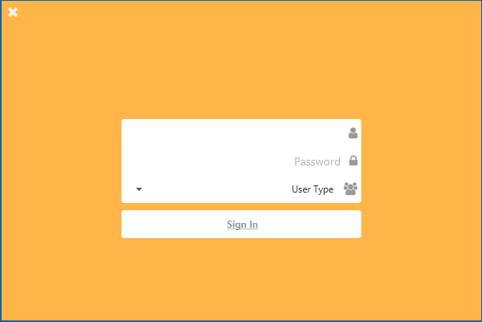
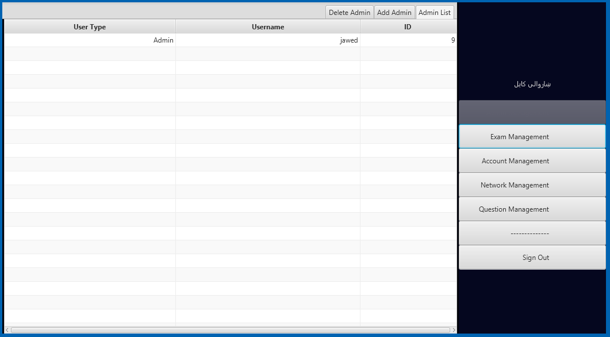
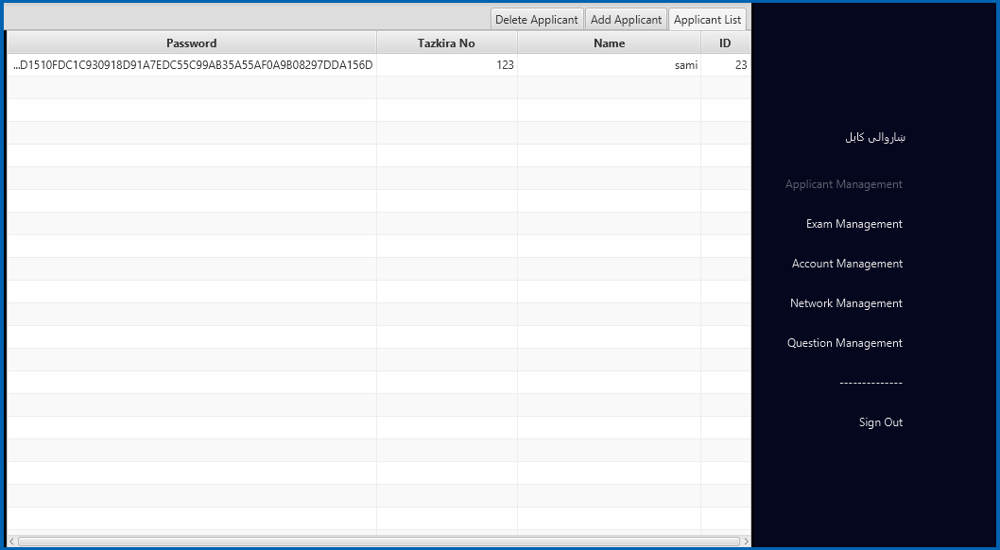
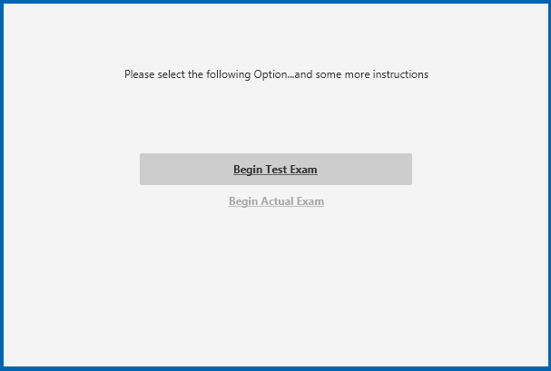
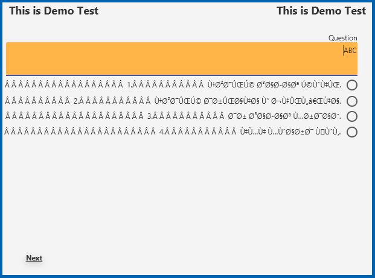

# Theoretical-Examination-System
TES (Theoretical Examination System) Theoretical Examination System is a desktop application developed using Java's JavaFx GUI library. 
It has three user types. Following are some of the screenshots from the application.  The Application is eventually supposed to used by 
Dari/ Persian speakers, so the orietation is from left to right, but the words are still in English which can be changed once the 
functionality is taken care of.

